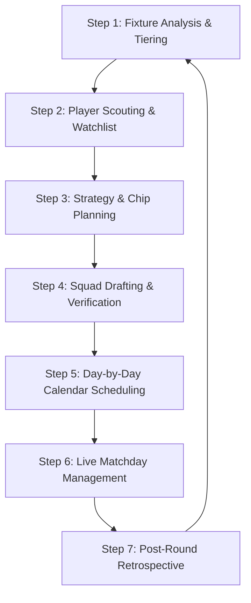

# 📋 FIFA Fantasy 2026 - Step-by-Step Team Selection & Management Process

This guide outlines the systematic, data-driven workflow for analyzing, selecting, and managing your FIFA Fantasy 2026 team. Following this step-by-step process ensures compliance with tournament rules, maximizes manual substitution efficiency, and optimizes point returns.

---

## 🔄 FIFA Fantasy Lifecycle Workflow

Below is the complete lifecycle of a fantasy round, from pre-round research to live management and post-round analysis.

---

## 🚶 Step-by-Step Process

### 📅 Step 1: Fixture Analysis & Match Tiering
Before looking at individual players, evaluate the round's matchups. Fixtures dictate both clean-sheet probability and goal-scoring expectations.
1. **Identify Kickoff Dates & Times:** List all matches chronologically. Kickoff schedules are the foundation of manual substitutions.
2. **Categorize Matchups into Tiers:**
   * **Tier 1 (Overwhelming Favorites):** Top-tier powerhouse nations facing clear underdogs (e.g., Argentina vs. Cape Verde, France vs. Sweden). Focus heavily on both offensive and defensive assets here.
   * **Tier 2 (Favorable Matches):** Strong favorites but with opponents capable of scoring (e.g., Spain vs. Austria, Germany vs. Paraguay). Excellent for target players, though clean sheets are more volatile.
   * **Tier 3 (Coin-Toss Matchups):** Evenly matched or highly defensive games (e.g., Netherlands vs. Morocco, Portugal vs. Croatia). Avoid over-investing in these fixtures to prevent losing assets early in knockout rounds.
3. **Verify Projections:** Cross-reference clean-sheet probabilities and expected goals (xG) using platforms like *Fantasy Football Scout* and *Fantasy Football Hub*.

---

### 🔍 Step 2: Player Scouting & Watchlist
Using the fixture tiers, identify players who offer the best value relative to their price and potential point returns.
1. **Premium Locks:** Select the elite, high-ownership players (e.g., Messi, Mbappé, Haaland) who serve as reliable captains and point-ceilings.
2. **Budget Enablers & Differentials:** Find players priced lower to free up budget. Pay special attention to:
   * Attacking defenders (wing-backs/fullbacks playing high up the pitch).
   * Midfielders who excel at tackles (1 pt per 3 tackles) and chance creation (1 pt per 2 key chances).
   * **Scouting Bonus Targets:** Players with **under 5% ownership** who can yield a +2 pt bonus if they score 4 or more points in a match.
3. **Check Status & Flags:** Ensure none of your targets are suspended, injured, or out of favor. Check press conferences and community news (e.g., Reddit, Twitter/X) for late lineup leaks.

---

### 🛡️ Step 3: Strategy & Chip/Booster Planning
Assess the rules and limitations of the current round to decide on transfer and booster strategy.
1. **Analyze Transfer Rules:**
   * If it's the **Round of 32**, utilize the **Unlimited Free Transfers** to completely rebuild the squad.
   * If it's another knockout round, budget your free transfers (4 in R16/QF, 5 in SF, 6 in Final) and check if taking a -3 point hit is worth it.
2. **Assess Bracket Longevity (Future-Proofing):** In knockout rounds, avoid loading up on players from teams that might get eliminated. Select at least 10–12 players from heavy favorites to progress deep into the tournament, saving transfers for later rounds.
3. **Deploy Boosters (Chips) Strategically:** Assess which chip matches the round's profile (only one chip can be used per round):
   * **Wildcard:** Rebuild team (use in Group Stages or Round of 16 if major upsets happen).
   * **12th Man:** Add a 12th player with no budget/nation limits.
   * **Maximum Captain:** Automatically doubles the highest scorer (best in rounds with multiple superstars playing).
   * **Qualification Booster:** +2 pts per progressing player (best in Semi-finals/Final when fewer teams remain).
   * **Clean Sheet Shield:** Keep CS points (+5) if a team concedes exactly 1 goal (best in cagey, defensive knockout rounds).

---

### ✏️ Step 4: Squad Drafting & Verification
Draft your 15-player squad while strictly validating budget and structural constraints.

> [!IMPORTANT]
> **Squad Validation Checklist:**
> * **Position Count:** Exactly 2 Goalkeepers, 5 Defenders, 5 Midfielders, and 3 Forwards.
> * **Budget Check:** Group stage = **$100.0M** limit; Knockout stage = **$105.0M** limit. Perform a manual summation to ensure no mathematical errors (e.g., do not trust rough plans without verifying actual price sheets).
> * **Nation Count Check:** Validate that your country representation does not exceed the round limit:
>   * *Groups & Round of 32:* Max **3** players per nation.
>   * *Round of 16:* Max **4** players per nation.
>   * *Quarter-finals:* Max **5** players per nation.
>   * *Semi-finals:* Max **6** players per nation.
>   * *Final / 3rd Place:* Max **8** players per nation.
> * **Injury/Flag Check:** Ensure the bench contains active players. Carrying red-flagged players on the bench renders manual substitutions ineffective.

---

### 📅 Step 5: Day-by-Day Calendar Scheduling
Arrange your starting XI and bench based entirely on match kickoff dates to utilize the manual substitution rules.
1. **Chronological Sorting:** Sort all 15 players in your squad by their match dates.
2. **Starting XI Placement:** Place players who play on the **earlier days** of the round in your starting XI.
3. **Bench Placement:** Place players who play on the **later days** of the round on your bench.
4. **Initial Captaincy:** Assign the captain's armband to a premium player playing on the earliest day of the round.
5. **Rule of Thumb:** *Never leave a later-playing player on the bench if you have an empty bench slot, as you cannot substitute players backwards.*

---

### 🏃 Step 6: Live Matchday Management
Actively monitor games during the live round to make manual substitutions and captaincy rotations.
1. **Manual Substitutions:**
   * After the early matches finish, review player scores in your starting XI.
   * If a starter underperforms (scores **1 to 3 points**), sub them out for a bench player who **has not yet played**.
   * *Warning:* Once a player is substituted out, their points are lost permanently. Red-carded players cannot be substituted.
2. **Captaincy Rotation:**
   * If your captain scores poorly (e.g., fails to score or assist), transfer the armband to a player who **has not yet played**.
   * Repeat this process across subsequent matchdays if necessary.
   * *Warning:* Once you transfer the armband away from a player, you cannot captain them again during that round.

---

### 📊 Step 7: Post-Round Retrospective
Analyze performance immediately after the round concludes to capture lessons for the next phase.
1. **Score Review:** Compare your overall score against your target and the round's average.
2. **Booster Assessment:** Check if your deployed chip yielded the expected advantage.
3. **Pinpoint Tactical Errors:**
   * Did you leave points on the bench (missed substitutions)?
   * Did you captain the wrong asset?
   * Did you carry flagged players?
   * Did you prioritize price over form/fixtures?
4. **Log Review:** Document these findings in a round review file (e.g., `round_X/reviews.md`) to refine the process for the next round.
